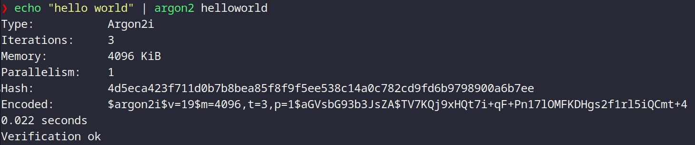

# HashTables

Também conhecido como array associativo, ou ainda dicionário. O HashMap é um tipo abstrato, ou seja, uma representação de como a implementação de um HashMap pode ser feita, contendo a descrição de seu funcionamento, funções contidas nele, entre outros. De maneira simple o HashMap é um tipo que armazena uma sequência de `chave`:`valor`, da qual cada chave é única, assim como um domínio de uma função na matemática.

[](https://en.wikipedia.org/wiki/Range_of_a_function)

Todo Map possui três funções básicas assimiladas à ele das quais são:

* Insert (put em Java) --> colocar uma nova sequência `chave:valor` no Map
* Remove (remove em Java) --> remove um `valor` a partir de uma `chave`
* Lookup (get em Java) --> pegar o `valor` a partir de uma `chave`

a partir dessas funções básicas é possível implementar outras mais complexas como:

* isEmpty --> checa se o Map está vazio
* containsKey --> checa se o Map possui uma certa chave
* containsValue --> checa se o Map possui um certo valor
* size --> retorna o tamanho do Map

essas funções adicionais dependem muito de qual ferramenta (nesse caso linguagem de programação) e de qual problema você precisa resolver. Como no caso estamos pensando em `Java` essas são algumas das funções básicas que você pode utilizar apenas importando de `java.util`:

```java
import java.util.HashMap;
import java.util.Map;
```

Repare que aqui não importamos apeans o Map, mas Também o `HashMap`, em java temos o `Map` que é uma interface, ou seja uma representação de o que um objeto deve ter, enquanto o `HashMap` é uma das classes default do Java que implementam essa interface. Além delas temos também outras semelhantes, como:

* HashTable
* TreeMap
* ConcurrentHashMap
* LinkedHashMap

De maneira geral você pode Utilizar da seguinte forma em seu programa:
```Java
HashMap<tipo_da_chave, tipo_do_valor> meuMap = new HashMap<tipo_da_chave, tipo_do_valor>();
```

Contudo, para projetos reais que vão demandar mudanças ao longo do tempo, é mais recomendado usar:

```Java
Map<tipo_da_chave, tipo_do_valor> meuMap = new HashMap<tipo_da_chave, tipo_do_valor>();
```

Isso pois ao utilizar o HashMap, ao dar manutenção no seu projeto, você terá que mudar todos os tipos de todas as funções, objetos, classes e etc. uma vez que o tipo `HashMap` é especifico da classe `HashMap`, enquanto que ao utilizar o `Map` você consegue generalizar o suficiente para poder utilizar diversas outras funções que possuem a interface `Map` implementada, como  até mesmo o próprio `HashMap`.

A partir desse conhecimento podemos implementar um programa simples em Java:

```java
import java.util.Map;
import java.util.HashMap;

public class MapTest{
  public static void main(String[] args){
    Map<String, Integer> ages = new HashMap<String, Integer>();

    ages.put("John", 30);
    ages.put("Mark", 18);
    ages.put("Albert", 65);
    ages.put("Alfred", 43);

    System.out.println(ages);

  }
}
```
usar o javac para compilar o projeto
```bash
javac MapTest.java
```
e usar o comando java para executar
```bash
java MapTest

(output)  {John=30, Mark=18, Albert=65, Alfred=43}

```

As `Hash Tables` utilizam internamente uma função `hash` que transforma as chaves em valores de tamanhos fixos. Se você já possui algum tipo de conhecimento na área de tecnologia, provavelmente você se lembrou de `checksums`, `encriptação de dados`, `encoding de dados`, de certa forma não está errado, mas lembre-se que os hashes usados em criptografia possuem outras características, geralmente eles são menos suscetíveis a `colisão`, possuem geralmente algum tipo de `salt` (usado geralmente para armazenar senhas e dados muito sensíveis), são geralmente maiores contendo por volta de `512 Bytes`.

Para o caso das senhas, hoje o mais recomendado a utilizar é o [argon2](https://github.com/P-H-C/phc-winner-argon2), por ser focado em segurança o algoritmo utiliza de diversas técnicas para devolver um hash que seja extremamente fácil de criar, mas extremamente custoso de quebrar. veja a baixo, há um exemplo  de uso dele:



No linux, temos esse utilitário, do qual podemos utilizar para gerar esses hashes. Aqui passo usando o `echo "hello world"` um exemplo de senha (no caso fraca demais, não utilize essa senha NUNCA!!!) e jogo para o argon essa senha e um salt que no caso é o `helloworld` e pronto, temos um hash de uma senha. \
`Obs: se você for usá-lo num projeto real, estude como utilizar, aqui apenas usei tudo padrão para uma demonstração rápida`

Seguindo essa linha, o `argon2` é perfeito para senhas e coisas similares, mas utilizar ele para hash tables seria demais, e provavelmente ineficiente, estaríamos utilizando mais poder computacional do que realmente precisamos. Por isso, geralmente utilizamos hash functions mais especificas e otimizadas para cada caso. No caso das HashTables, de uma forma mais simples, `podemos  descreve-las como arrays que contêm um array contendo a chave e o valor`

```
  chave: a
  valor: b
  hash: 0

  chave: b
  valor: c
  hash: 1

  [ 
    [a, b]
    [b, c] 
  ]

```

Como visto nesse exemplo, o valor da Hash é um número que representa o index no array do qual armazenará o par ordenado (chave, valor).Obviamente esse exemplo foi muito simples, e existem diversos approaches para isso com mais informações, menos, etc. Mas a ideia aqui é mostrar que, no geral,as funções de hash vão pegar um tipo  de valor que está representando a chave, e irá devolver um número  representando o index nesse array. 

Existem N maneiras de fazer isso aqui vão algumas ideias:


- Números inteiros como chave (modular hashing): \
Utilize um HashMap do qual seu tamanho seja um número primo *M*, e para cada chave faça `k mod M`.

- Números decimais como chave: \
Encontre o número inteiro mais próximo, e depois faça o `modular hashing`.

- Strings como chave: \
Podemos iterar sobre o tamanho da string, e para cada valor do character i fazemos o seguinte: `hash = (R * hash + s.charAt(i)) % M;`, o código em Java para isso pode ser o seguinte:

```java
public class HashString{
    public static void main(String[] args){
        int hash = 0;
        int R = 29;
        String s = args[0]; 
        int M = 97;


        for (int i = 0; i < s.length(); i++)
            hash = (R * hash + s.charAt(i)) % M;

        System.out.println(hash);
        
    }
}
```

Nesse exemplo, *R* é um número primo pequeno, *s* é a string que está sendo passada pela linha de comando e *M* é novamente o tamanho da Hash Table representada por um número primo.

compilando:

```bash
javac HashString.java
```

Executando:

```bash
java HashString Hello-world

output: 30
```

Como dito anteriormente, existem *N* maneiras de fazer isso, mas para ter certeza que você está implementando uma boa função hash, aqui vão alguns requerimentos:

1. A função deve retornar os mesmos valores para as mesmas entradas;
2. Deve ser rápido de se computar;
3. Sua função deve distribuir as chaves uniformemente.

Contudo, mesmo seguindo esses requerimentos, eventualmente você irá se deparar com `colisões`, seja por chaves repetidas ou por problemas com a função hash. Para contornar isso, existem algumas saídas, como:

1. reescrever o valor que está naquela posição;
2. criar naquela posição uma especie de galho, possuindo uma linked-list com os valores em sequência. Dessa forma, para achar um valor o algoritmo terá de encontrar o index e seguir  a linked-list até o valor. Esse approach é conhecido como [Separate Chaining](https://www.scaler.com/topics/data-structures/separate-chaining/);
3. Caso haja uma colisão, você insere no próximo slot vazio. Esse approach é conhecido como [open addressing](https://www.scaler.com/topics/data-structures/open-addressing/).

---

Por fim, após vermos um pouco de como o HashMap funciona, podemos ver alguns fatores de performance da estrutura:

1. Capacidade Inicial: \
Como o nome sugere, a capacidade Inicial é a quantidade de slots vazios aos instanciar um HashMap, no caso de Java é 16.

```
  HashMap após instanciado vazio em Java:

[
  [],
  [],
  [],
  [],
  [],
  [],
  [],
  [],
  [],
  [],
  [],
  [],
  [],
  [],
  [],
  [],
]
```

2. Fator de carga: \
Valor decimal que representa a porcentagem, do qual a estrutura pode se manter antes de aumentar seu tamanho. O padrão para isso é 75%.
A relação que descreve isso é a seguinte:

```
n/k

n = número de slots ocupados
k = número total de slots
```

Sendo assim, quando a relação acima alcançar valores maiores ou iguais a 75%, a HashTable passará por um processo de Rehashing.

3. Limiar: \
Quantidade de  espaços que podem ser ocupados antes do Rehashing.Valor do qual é descrito pela seguinte relação:

```
k * α

k = número total de slots
α = fator de carga (valor em decimal) 
```

4. Rehashing: \
O Rehashing, consiste em criar uma nova hashTable com um tamanho maior (2x, 3x, etc.) e transferir cada valor contido na antiga hashTable para dentro desse novo recalculando cada hash.  


Linguagens, como Java, lhe permitem setar alguns desses valores, como o fator de carga e a capacidade inicial. Uma ideia que a maioria das pessoas poderia ter é, criar um HashMap com uma capacidade inicial grande, de forma que nunca seja necessário fazer o Rehashing (já que isso é um pouco custoso). Contudo isso depende muito do caso, uma vez que mesmo que você não precise fazer o Rehashing, neste exemplo, outras operações como as de inserção, remove, etc. demorarão mais para serem executadas devido ao espaço a ser percorrido, novamente dependendo das estratégias usadas. \
Sendo assim, ao usar o HashTable, certifique-se de usar o melhor approach para o que seu projeto precisa e lembre-se que cada caso é um caso.  

*referências*:
* [Associative Array (Wikipedia)](https://en.wikipedia.org/wiki/Associative_array)
* [Abstract Data Type (Wikipedia)](https://en.wikipedia.org/wiki/Abstract_data_type)
* [interface em Programação (Wikipedia)](https://pt.wikipedia.org/wiki/Interface_(programa%C3%A7%C3%A3o_orientada_a_objetos))
* [Java Map (Trybe)](https://blog.betrybe.com/java/java-map/)
* [Difference Between Map and HashMap (StackOverflow)](https://stackoverflow.com/questions/1348199/what-is-the-difference-between-the-hashmap-and-map-objects-in-java)
* [Map and HashMap Java(JavaTPoint)](https://www.javatpoint.com/map-and-hashmap-in-java)
* [HashTable (Wikipedia)](https://en.wikipedia.org/wiki/Hash_table)
* [Hash Function (Wikipedia)](https://en.wikipedia.org/wiki/Hash_function)
* [HashTables (Princeton)](https://algs4.cs.princeton.edu/34hash/)
* [HashMap Java (AcervoLima)](https://acervolima.com/hashmap-em-java-com-exemplos-1/)
* [Rehashing (JavaTPoint)](https://www.javatpoint.com/rehashing-in-java)