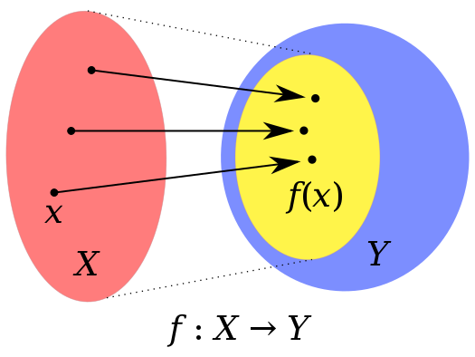

# HashTables

Também comhecido como array associativo, ou ainda dicionário. O Map é um tipo abstrato, ou seja, uma representação de como a implementação de um Map pode ser feita, contendo a descrição de seu funcionamento, funções contidas nele, entre outros. De maneira simple o Map é um tipo que armazena uma sequência de `chave`:`valor`, da qual cada chave é única, assim como um domínio de uma função na matemática.

[](https://en.wikipedia.org/wiki/Range_of_a_function)

Todo Map possui três funções básicas assimiladas à ele das quais são:

* Insert (put em Java) --> colocar uma nova sequência `chave:valor` no Map
* Remove (remove em Java) --> remove um `valor` a partir de uma `chave`
* Lookup (get em Java) --> pegar o `valor` a partir de uma `chave`

a partir dessas funções básicas é possível implementar outras mais complexas como:

* isEmpty --> checa se o Map está vazio
* containsKey --> checa se o Map possui uma certa chave
* containsValue --> checa se o Map possui um certo valor
* size --> retorna o tamanho do Map

essas funções adicionais dependem muito de qual ferramenta (nesse caso linguagem de programação) e de qual problema você precisa resolver. Como no caso estamos pensando em `Java` essas são algumas das funções básicas que você pode utilizar apenas importando de `java.util`:

```java
import java.util.HashMap;
import java.util.Map;
```

Repare que aqui não importamos apeans o Map, mas Também o `HashMap`, em java temos o `Map` que é uma interface, ou seja uma representação de o que um objeto deve ter enquanto o `HashMap` é uma das classes default do Java que implementam essa interface além delas temos outras também como:

* HashTable
* TreeMap
* ConcurrentHashMap
* LinkedHashMap

De maneira geral você pode Utilizar da seguinte forma em seu programa:
```Java
HashMap<tipo_da_chave, tipo_do_valor> meuMap = new HashMap<tipo_da_chave, tipo_do_valor>();
```

Contudo, para projetos reais que vão demandar mudanças ao longo do tempo, é mais recomendado usar:

```Java
Map<tipo_da_chave, tipo_do_valor> meuMap = new HashMap<tipo_da_chave, tipo_do_valor>();
```

Isso pois ao utilizar o HashMap você vai ter que mudar os tipos de todas as funções, objetos, classes e etc. que recebem esse `meuMap` como argumento ou que utilizam de alguma outra forma, ao dar manutenção no código, uma vez que o tipo `HashMap` é especifico da classe `HashMap`, enquanto que ao utilizar o `Map` você consegue generalizar o suficiente para poder utilizar diversas outras funções que possuem a interface `Map` implementada.


A partir desse conhecimento podemos implementar um programa simples em Java:

```java
import java.util.Map;
import java.util.HashMap;

public class MapTest{
  public static void main(String[] args){
    Map<String, Integer> ages = new HashMap<String, Integer>();

    ages.put("John", 30);
    ages.put("Mark", 18);
    ages.put("Albert", 65);
    ages.put("Alfred", 43);

    System.out.println(ages);

  }
}
```
usar o javac para compilar o projeto
```bash
javac MapTest.java
```
e usar o comando java para executar
```bash
java MapTest

(output)  {John=30, Mark=18, Albert=65, Alfred=43}

```

*references*:
* [Associative Array (Wikipedia)](https://en.wikipedia.org/wiki/Associative_array)
* [Abstract Data Type (Wikipedia)](https://en.wikipedia.org/wiki/Abstract_data_type)
* [interface em Programação (Wikipedia)](https://pt.wikipedia.org/wiki/Interface_(programa%C3%A7%C3%A3o_orientada_a_objetos))
* [Java Map (Trybe)](https://blog.betrybe.com/java/java-map/)
* [Difference Between Map and HashMap (StackOverflow)](https://stackoverflow.com/questions/1348199/what-is-the-difference-between-the-hashmap-and-map-objects-in-java)
* [Map and HashMap Java(JavaTPoint)](https://www.javatpoint.com/map-and-hashmap-in-java)
* [HashTable (Wikipedia)](https://en.wikipedia.org/wiki/Hash_table)
